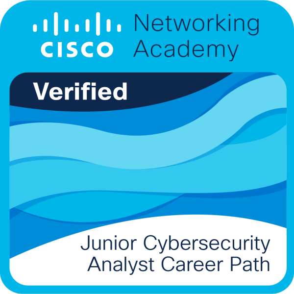
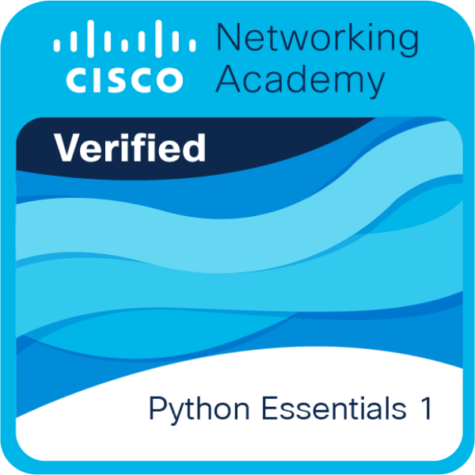
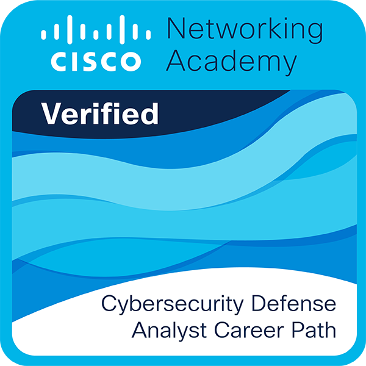
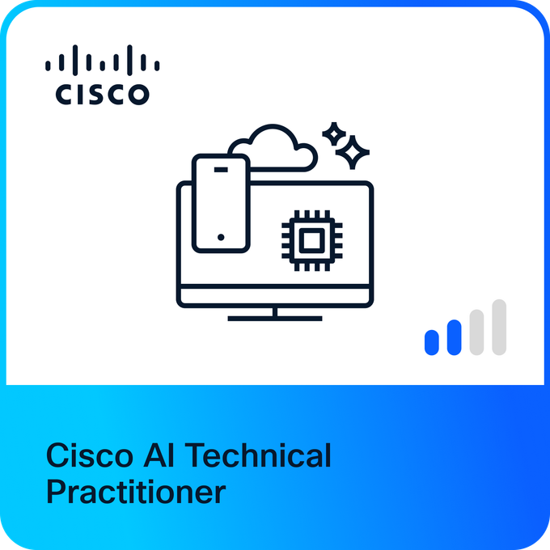
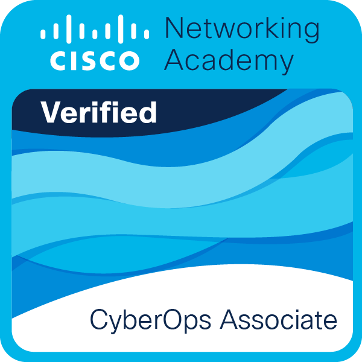

Hi, I'm Qudus T. Afolabi 👋

Cybernetics | Cybersecurity • SOC • Detection Engineering | Python | AI

I'm an aspiring cybersecurity professional interested in Security Operations (SOC), defensive security, detection engineering, Python, and Artificial Intelligence.

I'm currently building my skills through hands-on labs, cybersecurity training, and personal programming projects.

🛡️ CYBERSECURITY

- Security Operations & SOC fundamentals
- Threat Detection & Analysis
- Incident Response
- Threat Hunting
- SIEM
- Splunk & SPL
- Detection Engineering
- MITRE ATT&CK
- Network & Endpoint Security

🐍 PROGRAMMING

- Python
- Git & GitHub
- Building beginner-friendly Python projects

🤖 AI

- Artificial Intelligence
- Generative AI
- Prompt Engineering
- AI & Cybersecurity

🏆 LEARNING CREDENTIALS & BADGES

🔐 Cybersecurity

- Cisco — Junior Cybersecurity Analyst Career Path
- Cisco — Cybersecurity Defense Analyst Pathway
- Cisco — CyberOps Associate
- TS Academy — Cybersecurity (Verification site: https://certificates.tsacademyonline.com/ | Cert ID: TS9D2CM4764JZK)

🤖 AI & Programming

- Cisco — AI Technical Practitioner
- Cisco — Python Essentials

🏅 Digital Badges

  
  &nbsp;&nbsp;
  
  &nbsp;&nbsp;
  

  
  &nbsp;&nbsp;
  
  &nbsp;&nbsp;
  

🚀 PROJECTS

I'm continuously building and documenting projects as I develop my technical skills.

- Python Quiz Portal
- Grade Calculator
- Restaurant Ordering System
- ATM Simulator
- Other cybersecurity and Python projects coming soon...

📚 Currently Learning

Detection Engineering • SOC Analysis • Python • Cybersecurity • AI

---

📫 Connect With Me

- X: "@xfricana" (https://x.com/xfricana)
- LinkedIn: "My LinkedIn Profile" (https://www.linkedin.com/in/qudus-afolabi-ab2099278/)

---

"Learning, building, and improving — one project at a time."
